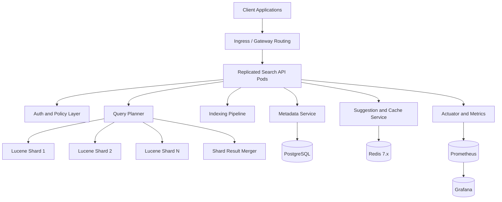
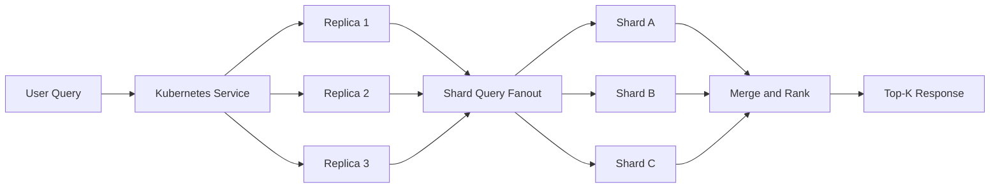
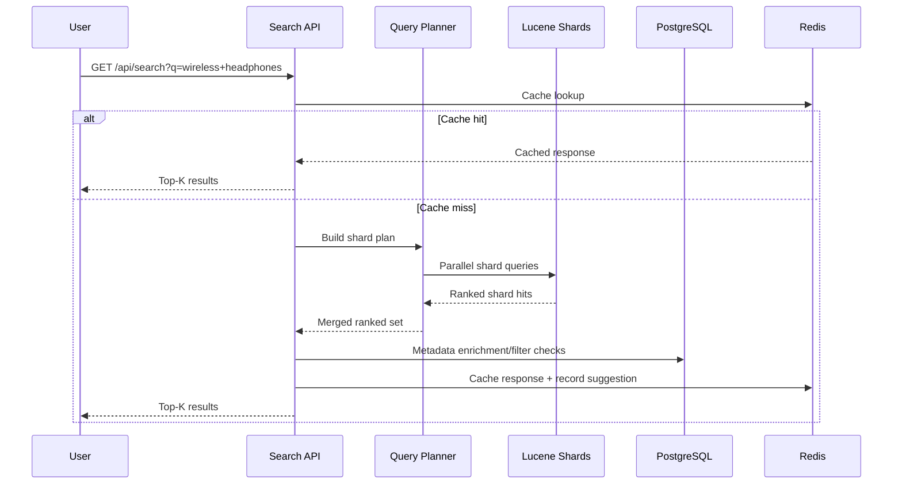
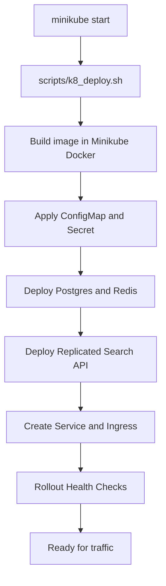

# Replicated Search and Indexing System

A production-ready lexical retrieval platform built for low-latency indexing and query serving with replicated application nodes, shard-aware Lucene indexing, metadata persistence, and Redis-backed acceleration.

## Table of Contents

- [Overview](#overview)
- [What This System Delivers](#what-this-system-delivers)
- [Architecture](#architecture)
- [Replication and Cluster Model](#replication-and-cluster-model)
- [Services](#services)
- [Data and Query Flow](#data-and-query-flow)
- [APIs](#apis)
- [Storage Layer](#storage-layer)
- [Observability and SLOs](#observability-and-slos)
- [Performance Profile](#performance-profile)
- [Local Deployment](#local-deployment)
- [Kubernetes Deployment (Minikube-First)](#kubernetes-deployment-minikube-first)
- [Batch Indexing and Refresh Workflows](#batch-indexing-and-refresh-workflows)
- [Repository Layout](#repository-layout)

## Overview

Replicated Search and Indexing System is designed for production lexical search workloads by combining:

- Lucene-based full-text retrieval and relevance scoring
- Replicated query-serving nodes behind Kubernetes service routing
- Shard-aware index management and merged top-k ranking
- PostgreSQL metadata persistence and tag modeling
- Redis-backed caching and suggestion acceleration
- REST and gRPC interfaces for client and service integration

The platform is optimized for large corpora and sustained low-latency query execution in containerized environments.

## What This System Delivers

- Real-time document indexing and lexical retrieval
- Horizontal replication for high availability and throughput
- Query fanout across Lucene shards with score-merged responses
- Metadata-aware filtering and document lifecycle management
- Redis hot-query cache and prefix/top suggestion APIs
- JWT-secured API access for indexing and search operations
- Kubernetes-native deployment with health checks and rollout controls
- Prometheus-compatible metrics for query and indexing observability

## Architecture



The runtime is split into serving, retrieval, and platform layers:

- Serving layer: API controllers, auth, request validation, result serialization
- Retrieval layer: shard query fanout, Lucene relevance ranking, merge logic
- Platform layer: metadata persistence, suggestion/cache, metrics and operations

## Replication and Cluster Model

This system uses replicated search-serving pods with Kubernetes orchestration:

- Stateless application replicas serve traffic behind a single Kubernetes service
- Lucene data is partitioned by shard key and queried in parallel
- Query coordinator merges shard responses into a unified top-k result
- Rolling deployments preserve availability during updates
- Minikube provides local production-like orchestration with free Kubernetes

Replication in this project is application-tier replication:

- Multiple identical API/runtime instances are deployed as Kubernetes replicas
- Kubernetes service routing distributes traffic across healthy replicas
- Replication improves availability and throughput for the serving layer

What this replication model is not:

- It is not Solr/Elasticsearch-style distributed index replication
- It is not cross-region data replication
- It is not microservice-per-domain decomposition in this repository



## Services

Core runtime services:

- `search-indexing-service`: primary API runtime for indexing, retrieval, metadata, auth, and suggestion endpoints
- `postgres`: metadata persistence for document fields and tags
- `redis`: cache and suggestion ranking store
- `monitoring stack`: Prometheus scrape + Grafana dashboards

Application capabilities exposed by service modules:

- Indexing manager for write, batch commit, and refresh policies
- Query planner for shard-aware fanout and bounded query execution
- Metadata service for CRUD and filter support
- Suggest service for prefix and popularity-based query assistance
- gRPC service implementations for low-overhead integration paths

## Data and Query Flow

Ingestion and indexing flow:

1. Client sends authenticated document payload.
2. Service validates request and persists metadata in PostgreSQL.
3. Index manager writes content to shard-selected Lucene index segments.
4. Batched commit/refresh policy makes documents visible to query path.
5. Metrics are emitted for write latency, failures, and index health.

Query flow:

1. Client submits authenticated query (`q`, `size`, `offset`, filters).
2. Query planner fans out request to relevant Lucene shards in parallel.
3. Shard results are merged and re-ranked into final top-k output.
4. Hot-query cache is checked/populated in Redis.
5. Suggestion counters and latency metrics are updated.



## APIs

### REST

- `POST /api/auth/register` - create user account
- `POST /api/auth/login` - issue JWT token
- `POST /api/index` - index document and persist metadata
- `GET /api/search` - lexical search with pagination
- `GET /api/suggest` - prefix suggestions
- `GET /api/suggest/top` - top query suggestions
- `POST /api/suggest/record` - record query popularity
- `POST /api/metadata` - create metadata record
- `GET /api/metadata` - list metadata records
- `GET /api/metadata/{id}` - fetch metadata by id
- `DELETE /api/metadata/{id}` - delete metadata
- `GET /api/tags` - list tags
- `GET /api/health` - service health

Example:

```bash
curl -X POST http://localhost:8080/api/index \
  -H "Authorization: Bearer <JWT_TOKEN>" \
  -H "Content-Type: application/json" \
  -d '{"title":"Sony WH-1000XM5","content":"wireless noise cancelling headphones","tags":["audio","headphones"]}'
```

### gRPC

gRPC contracts are available for high-throughput integration via:

- `src/main/proto/SearchService.proto`
- `src/main/proto/MetadataService.proto`

## Storage Layer

- Lucene shards: lexical inverted index segments and relevance scoring data
- PostgreSQL: document metadata, tag entities, and relation mappings
- Redis 7.x: query cache entries and suggestion sorted sets

Representative relational entities:

- `document_meta`
- `tag`
- `document_tag`
- `user`

## Observability and SLOs

Operational metrics are exposed through Spring Actuator and Prometheus format endpoints.

Key metrics:

- `search_query_count_total`
- `search_query_latency_ms`
- `index_write_count_total`
- `index_write_latency_ms`
- `shard_fanout_duration_ms`
- `merge_duration_ms`
- `cache_hit_count_total`
- `cache_miss_count_total`

Primary service objectives:

- p95 query latency under 200ms for production benchmark profile
- index write success rate above 99%
- non-2xx/error rate below 1%
- stable cache hit ratio under sustained mixed-query traffic

## Performance Profile

Validated operating profile:

- Dataset scale: up to 1,000,000 documents
- Query mix: lexical dominant with metadata filters
- Concurrency: 20-50 virtual users
- Sustained load: 15-30 QPS
- Result size: top-k = 20
- SLO: p95 search latency < 200ms

Latency budget model:

- Request auth and validation: <= 20ms
- Shard fanout and retrieval: <= 90ms
- Merge/rank/serialization: <= 50ms
- Metadata and cache operations: <= 40ms

## Local Deployment

Prerequisites:

- Java 21+
- Maven 3.9+
- Docker + Docker Compose

Build and run:

```bash
git clone https://github.com/arup-chauhan/Replicated-Search-and-Indexing-System.git
cd Replicated-Search-and-Indexing-System
mvn clean package
docker compose up --build -d
```

Stop local stack:

```bash
docker compose down
```

## Kubernetes Deployment (Minikube-First)

Minikube is the default free Kubernetes path for local production-like deployment.

```bash
minikube start
./scripts/k8_deploy.sh
```

The deployment script performs:

- image build in Minikube Docker environment
- manifest rendering and apply for app + stateful dependencies
- rollout waits for Postgres, Redis, and replicated app deployment
- ingress host mapping output for local routing



## Batch Indexing and Refresh Workflows

Batch and refresh controls are implemented for stable indexing behavior under high-volume writes:

- `index_batch_flush`: buffered document writes with commit interval control
- `index_refresh`: scheduled refresh for near-real-time query visibility
- `cache_refresh`: invalidation and warmup after index updates
- `metadata_refresh`: consistency sweep for metadata-index alignment

Design boundary:

- Online query path remains low-latency and synchronous.
- Batch controls handle write amplification and refresh policy management.

## Repository Layout

- `src/main/java/com/engine/api/`
- `src/main/java/com/engine/indexing/`
- `src/main/java/com/engine/query/`
- `src/main/java/com/engine/metadata/`
- `src/main/java/com/engine/suggest/`
- `src/main/java/com/engine/security/`
- `src/main/proto/`
- `src/main/resources/`
- `k8/`
- `helm/replicated-search-indexing-system/`
- `charts/replicated-search-indexing-system/`
- `monitoring_microservice/`
- `openapi/`
- `scripts/`
- `docker-compose.yml`
- `pom.xml`
