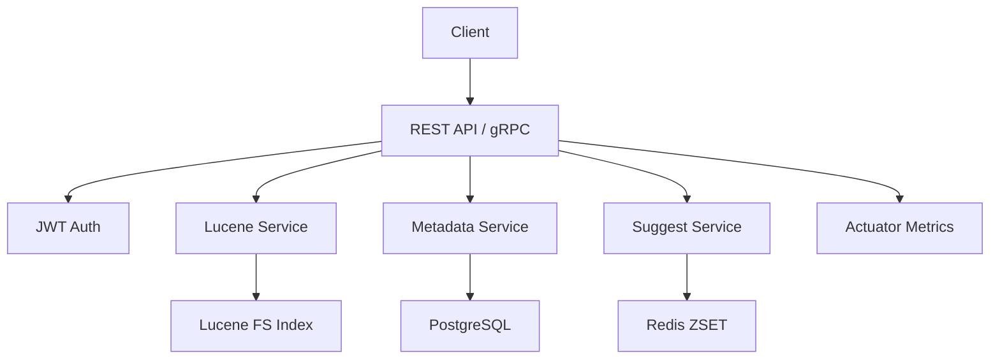

# **Replicated Search and Indexing System**

A resource-efficient search service for **lexical retrieval + metadata filtering**, powered by **Apache Lucene**, **PostgreSQL**, and **Redis suggestions**.

---

## **Table of Contents**

- [Project Overview](#project-overview)
- [Features](#features)
- [System Architecture](#system-architecture)
- [Installation](#installation)
- [Usage](#usage)
- [API Endpoints](#api-endpoints)
- [Example Output](#example-output)
- [Caching & Storage](#caching--storage)
- [Database](#database)
- [Monitoring & Scaling](#monitoring--scaling)
- [Docker Deployment](#docker-deployment)
- [Kubernetes Deployment (Minikube)](#kubernetes-deployment-minikube)
- [gRPC Services](#grpc-services)
- [Contributing](#contributing)

---

## **Project Overview**

The **Replicated Search and Indexing System** currently integrates:

- **Apache Lucene** for full-text indexing and relevance search.
- **PostgreSQL** for document metadata and tags.
- **Redis** for query suggestion popularity tracking.
- **JWT-based auth** for protected REST endpoints.
- **REST + gRPC APIs** for programmatic integration.
- **Docker + Kubernetes (minikube-first)** for deployment.
- **Prometheus metrics endpoint** via Spring Actuator.

### **Current Production Profile**

- Spring Boot application layer.
- Lucene filesystem index (`ENGINE_INDEX_PATH`).
- PostgreSQL metadata persistence.
- Redis suggestion store.
- Kubernetes manifests targeting Minikube workflow.

### **Operating Envelope (Current vs Target)**

- Current safe operating range is small-to-mid scale (before performance hardening tasks are completed).
- Target roadmap (tracked in `GAPS_TODO.md`):
  - Up to **1M documents**.
  - **p95 < 200ms** query latency under defined benchmark load.

---

## **Features**

Implemented now:

- Lucene-backed indexing and search.
- Metadata CRUD with PostgreSQL/JPA.
- Tag association and retrieval.
- Redis-powered search suggestions.
- JWT login/register flow for API access.
- REST endpoints for indexing/search/metadata/suggestions.
- gRPC search service.

Roadmap:

- Stronger distributed indexing/query strategy.
- Full benchmark harness with reproducible SLO gates.
- Helm templates completion.

---

## **System Architecture**



---

## **Installation**

### **Prerequisites**

- Java 21+
- Maven 3.9+
- PostgreSQL
- Redis 7.2.x
- Docker & Kubernetes (Minikube for local cluster)

### **Clone the Repository**

```bash
git clone https://github.com/Arup-Chauhan/Replicated-Search-and-Indexing-System.git
cd Replicated-Search-and-Indexing-System
```

### **Build**

```bash
mvn clean package
```

---

## **Usage**

### **Register + Login**

```bash
curl -X POST "http://localhost:8080/api/auth/register?username=arup&password=pass123"
TOKEN=$(curl -s -X POST "http://localhost:8080/api/auth/login?username=arup&password=pass123" | jq -r '.token')
```

### **Index a Document**

```bash
curl -X POST http://localhost:8080/api/index \
  -H "Authorization: Bearer $TOKEN" \
  -H 'Content-Type: application/json' \
  -d '{"title":"Doc One","content":"Hello Lucene world","tags":["hello","lucene"]}'
```

### **Search**

```bash
curl "http://localhost:8080/api/search?q=hello&size=10&offset=0" \
  -H "Authorization: Bearer $TOKEN"
```

---

## **API Endpoints**

Auth:
- **POST /api/auth/register**
- **POST /api/auth/login**

Search & Index:
- **POST /api/index**
- **GET /api/search**

Suggestions:
- **POST /api/suggest/record**
- **GET /api/suggest/top**
- **GET /api/suggest**

Metadata & Tags:
- **POST /api/metadata**
- **GET /api/metadata/{id}**
- **GET /api/metadata**
- **DELETE /api/metadata/{id}**
- **GET /api/tags**

Health:
- **GET /api/health**

---

## **Example Output**

**Search Response:**

```json
[
  {
    "id": "1",
    "title": "Doc One",
    "score": 0.43
  }
]
```

---

## **Caching & Storage**

- **Lucene index** → full-text inverted index on local filesystem path.
- **PostgreSQL** → metadata and tag persistence.
- **Redis** → suggestion popularity store (`search:suggestions` sorted set).

---

## **Database**

- JPA entities include:
  - `document_meta`
  - `tag`
  - join table `document_tag`
  - auth `user` entity table (generated by JPA)

- Metadata and search index are currently written in sequence; consistency hardening is tracked in `GAPS_TODO.md`.

---

## **Monitoring & Scaling**

- Actuator endpoints exposed:
  - `/actuator/health`
  - `/actuator/info`
  - `/actuator/prometheus`

- Metrics include Lucene indexing counters (Micrometer).

- Scale roadmap (tracked in `GAPS_TODO.md`):
  - batched Lucene commits,
  - query guardrails,
  - benchmark-driven tuning,
  - shard strategy for higher throughput.

---

## **Docker Deployment**

```bash
docker compose up --build
```

Verify:

```bash
curl http://localhost:8080/api/health
```

---

## **Kubernetes Deployment (Minikube)**

```bash
minikube start
./scripts/k8_deploy.sh
```

The script:
- builds the app image in Minikube Docker,
- applies manifests from `k8/`,
- waits for rollout completion,
- prints host mapping for ingress.

---

## **gRPC Services**

Proto definitions:
- `src/main/proto/SearchService.proto`
- `src/main/proto/MetadataService.proto`

Implemented service status:
- `SearchService`: wired to Lucene search and Redis query recording.
- `MetadataService`: currently placeholder response logic (planned DB-backed implementation in gaps baseline).

---

## **Contributing**

Contributions are welcome.

Start from `GAPS_TODO.md` for prioritized P0/P1/P2 baseline tasks and scale targets.
